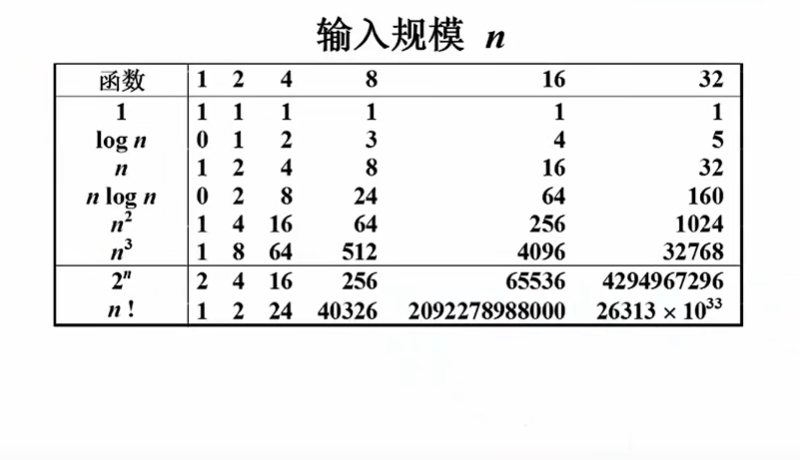
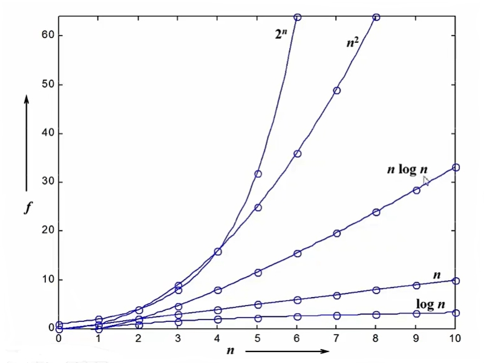
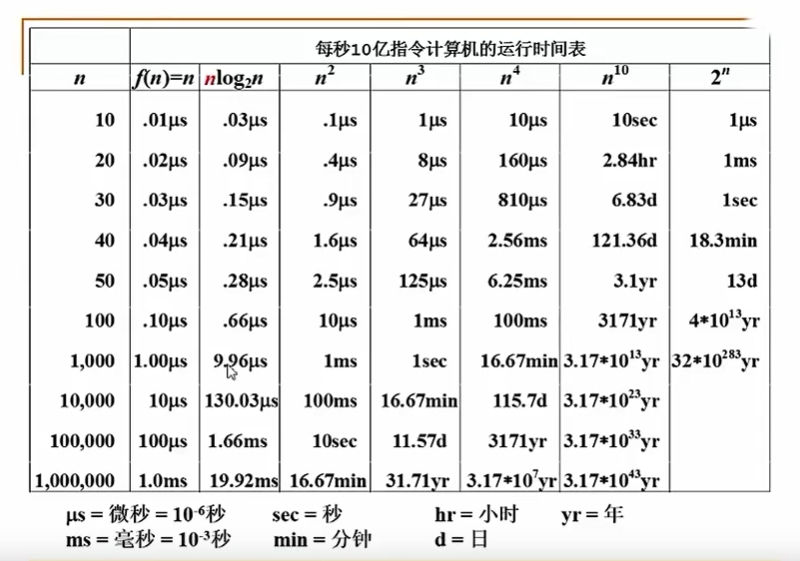

# 复杂度的渐进表示

:::tip 注意
**复杂度的表示法，钧以时间复杂度为例**
:::

T(n) = O(f(n))表示存在常数C > 0，n0 > 0 使得当 n >= n0时有T(n) <= C*f(n)  `表示的T(n)的某种上界`

T(n) = Ω(g(n))表示存在常数C > 0，n0 > 0 使得当 n >= n0时有T(n) >= C*g(n)  `表示的T(n)的某种下界`

T(n) = Θ(h(n))表示同时有T(n) = O(h(n)) 和 T(n) = Ω(h(n)) `既是上界，也是下届，相当于是等价关系`
****
## 不同复杂度函数的直观表现

**由上图不难看出，log n 是最好的函数**

## 复杂度分析技巧
**两段算法**分别有复杂度T1(n) = O(f1(n)) 和 T2(n) = O(f2(n)) 
- 拼接：T1(n) + T2(n) = max(O(f1(n)) + O(f2(n)))
- 嵌套：T1(n) + T2(n) = O(f1(n)) * O(f2(n))

**for循环**的时间复杂度等于循环次数乘以循环体代码的复杂度。

**if-else** 结构的复杂度取决于`if的条件判断复杂度`和`两个分支部分的复杂度`，总体复杂度取三者中最大的。

## 复杂度分析
:::tip 重要
算法实现的过程，复杂度分析的过程
:::

[1,-2,6,-5,6,2,-3,8,-3,4,2,-1]

* 方法一：所有的连续子列和都计算出来 O(n^3)
* 方法二：方法一优化一层 O(n^2)
* 方法三：分而治之 O(n*log n)
* 方法四：在线处理 O(n) （读）