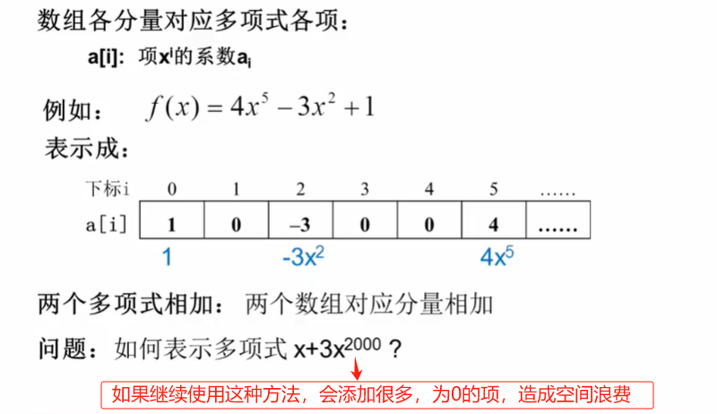
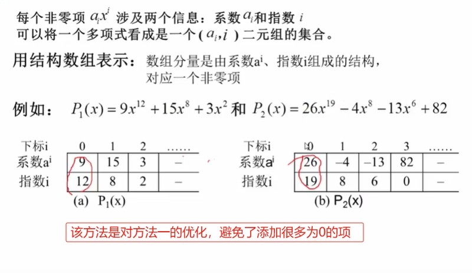
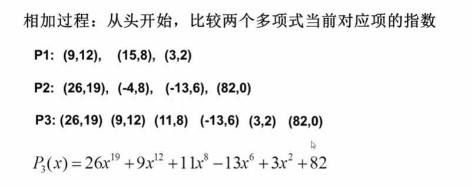
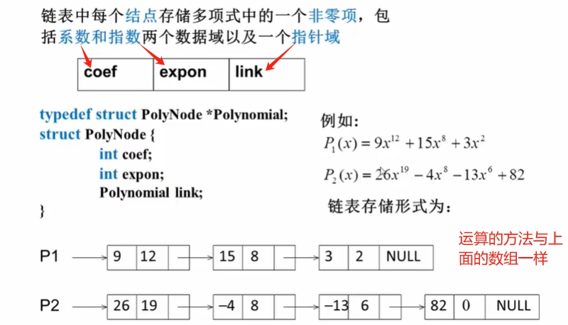

# 多项式的表示

f(x) = a0 + a1x + ... + an-1xn-1 + anxn

**一元多项式如何在程序设计语言中表示,`相加`、`相减`、`相乘`？** 

:::tip 【分析】：如何表示多项式？
1. 多项式的项数 n
2. 各项系数 ai 及其指数 i
:::

## 方法一：顺序存储结构的直接表示

## 方法二：顺序存储结构表示非零项

除了以上数组的方法，还可以使用链表的存储方式
## 方法三：链表结构存储非零项

## 启示
::: tip 多项式表示的启示
1. 同一个问题可以有不同的表示（存储）方法。
2. 有一类共性问题：有序线性序列的组织和管理。
:::