# 什么是图

:::info 【示例】
`六度空间理论`：你和任何一个不相识的陌生人之间相隔的人数不会超过六个。

`村村通`：

:::

:::tip :star::star::star: 重要 :star::star::star:
线性表是`一对一`的关系，树是`一对多`的关系，而**图则表示**`多对多`的关系。线性表、树 是图的特殊情况。
:::

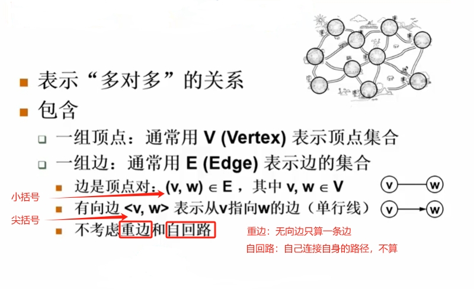

## 抽象数据类型描述
- 类型名称：图（Graph）；
- 数据对象集：G（V,E）由`一个非空的有限顶点集合 V `和`一个有限边集合 E `组成；
- 操作集：对于任意图 G ∈ Graph，以及 v ∈ V，e ∈ E；
  > 1. Graph Create()：建立并返回空图；
  >
  > 2. Graph InsertVertex(Graph G, Vertex V)：将 V 差入 G（插入顶点）；
  >
  > 3. Graph InsertEdge(Graph G, Edge e)：将 e 插入 G （插入边）；
  >
  > 4. void DFS(Graph G, Vertex V)：从顶点v出发深度优先遍历图G；
  >
  > 5. void BFS(Graph G, Vertex V)：从顶点v出发广度优先遍历图G；
  >
  > 6. void ShortestPath(Graph G, Vertex V, int Dist[])：计算图 G 中顶点 v 到任意其他顶点的最短距离；
  >
  > 7. void MST(Graph G)：计算图 G 的最小生成树；
  >
  > ......
## 图的术语

1. 有向图
2. 无向图
3. 网络
4. .......

## 邻接矩阵【数组表示图】
左边的图 用 矩阵表示
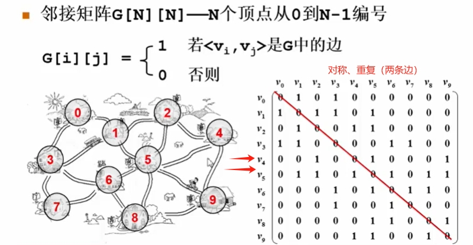

**存在的问题**：对于无向图的存储，怎么样可以省一半的空间？

**解决方法**：如图
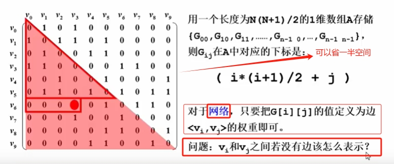

**邻接矩阵优点**：
1. 直观、简单、好理解；
2. 方便检查任意一对顶点间是否存在边；
3. 方便找任一顶点的所有“邻接点”（有边直接相连的顶点）；
4. 方便计算任一顶点“度”（从该点发出的边数为“出度”，指向该点的边数为“入度”）；
  > 无向图：对应行（或列），非0元素的个数；
  >
  > 有向图：对应行非0元素的个数是“出度”，对应列非0元素的个数是“入度”；

**邻接矩阵缺点**：
1. 浪费空间：对稠密图（完全图）还是很合算的 ，对于稀疏图（点多 边少）有大量无效元素；
2. 浪费时间：统计稀疏图中一共有多少条边（需要扫描一遍系数图）；
## 邻阶接表【链表表示图】
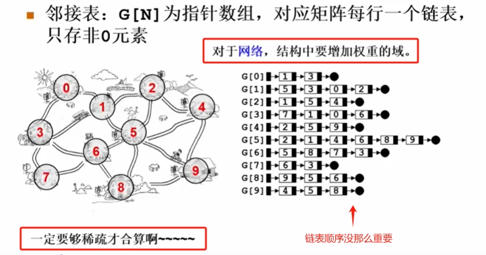
**邻接表优点**：
<!--  -->
1. 便找任一顶点的所有“邻接点”；
2. 节约稀疏图的空间；
  > 需要N个头指针+2E个结点(每个结点至少2个域)
3. 计算任一顶点的“度”（无向图）方便；
**邻接表缺点**：
1. 计算任一顶点的“度”（有向图）困难；
  > 对有向图:只能计算“出度”;需要构造“逆邻接表”(存指向自己的边)来方便计算“入度”
2. 不方便检查任意一对顶点间是否存在边；

:::info 注意
除了邻接矩阵、邻接表，图的表示方式有很多种，如：
1. 邻接多重表
2. 十字链表
3. 边

具体要看解决什么类型的问题。
:::

## 图的遍历

### DFS(深度优先)

### BFS(广度优先)
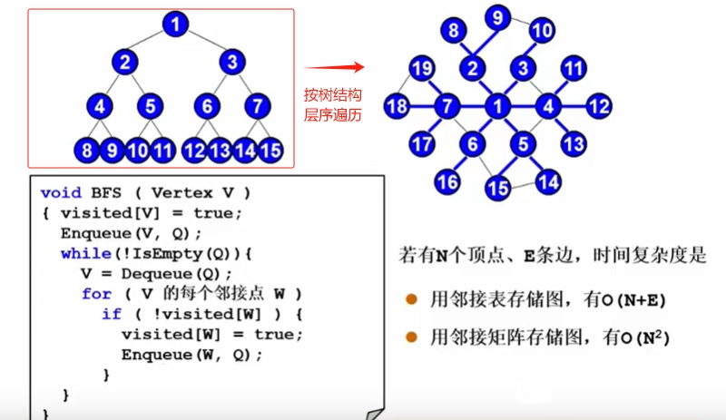

 
 

:::tip 为什么需要这两种遍历方式呢

通过下面示例对比了解（走迷宫）

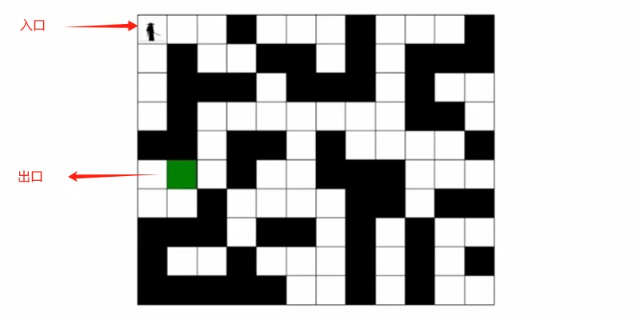

DFS规则:顺时针寻找相邻连接点（当然也可以定其他规则）

| ⑧   | ①                         | ②   |
| --- | ------------------------- | --- |
| ⑦   | :triangular_flag_on_post: | ③   |
| ⑥   | ⑤                         | ④   |

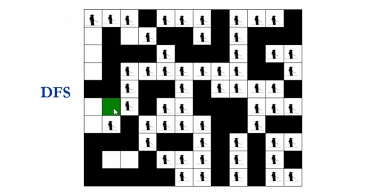

DFS规则: 首先入口进入队列，然后开始把相邻的格子加入队列，一圈一圈的开始遍历搜索。

| ②   | ②   | ②                         | ②   | ②   |
| --- | --- | ------------------------- | --- | --- |
| ②   | ①   | ①                         | ①   | ②   |
| ②   | ①   | :triangular_flag_on_post: | ①   | ②   |
| ②   | ①   | ①                         | ①   | ②   |
| ②   | ②   | ②                         | ②   | ②   |

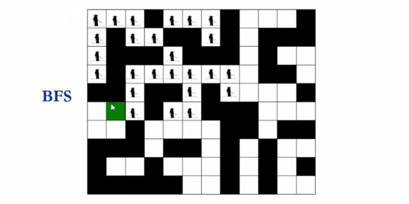

:::

图遍历，是从一个结点出发，沿着边的方向，依次访问图中其它各结点，且每个结点仅被访问一次。

:::tip 图遍历的一些概念

1. `连通`：如果从V到W存在一条（无向）路径，则称V和W是连通的；
2. `路径`：从顶点V到顶点W存在一系列顶点{V,V1,V2...,W}的集合，其中任一对相邻的顶点间都有图中的边相连接的，
   - 路径长度：是路径中的边数（如果有带权，则是所有边的权重和）；
   - 如果V到W之间的所有顶点都不同，则称`简单路径`，如果有回路就是不是简单路径；
3. `回路`：从顶点V到顶点V的一条路径；
4. `连通图`：图中任意两个顶点钧连通；
5. `连通分量`：**无向图**的极大连通子图；
     - 极大顶点数：再加一个顶点就不连通了；
     - 极大边数：包含子图中所有顶点相连的所有边；
    :::info 示例
    <svg  width="100%" height="400">
      <circle cx="20" cy="100" r="16" style="stroke: #00bb8c;fill:#00bb8c"/>
      <circle cx="120" cy="40" r="16" style="stroke: #00bb8c;fill:#00bb8c"/>
      <circle cx="220" cy="100" r="16" style="stroke: #00bb8c;fill:#00bb8c"/>
      <circle cx="120" cy="160" r="16" style="stroke: #00bb8c;fill:#00bb8c"/>
      <circle cx="80" cy="100" r="16" style="stroke: #00bb8c;fill:#00bb8c"/>
      <circle cx="160" cy="100" r="16" style="stroke: #00bb8c;fill:#00bb8c"/>
      <text style="font-size: 18px;">
        <tspan x="114" y="44">A</tspan>
        <tspan x="214" y="104">B</tspan>
        <tspan x="114" y="164">C</tspan>
        <tspan x="14" y="104">D</tspan>
        <tspan x="74" y="104">E</tspan>
        <tspan x="154" y="104">F</tspan>
      </text>
      <path d="M 20 100 L 120 40 L220 100 L120 160 L20 100" fill="none" style="stroke: #00bb8c;"/>
      <path d="M 80 100 L 160 100" fill="none" style="stroke: #00bb8c;"/>
    </svg>

6. `强连通`：有向图中顶点v和w之间存在双向路径（V-->W，或者W-->V往返的路径不一定是同一条），则称v和W是强连通的；
7. `强连通图`：有向图中任意两顶点均强连通；
    - 弱连通图：强连通图边的方向抹掉，就是弱连通图；
8. `强连通分量`：有向图的极大强连通子图；
:::

## 图的算法事例
1. 拯救007
2. 六度空间
3. 哈利波特咒语
4. ...

## 最短路径
生活中从A地点到B地点，花最短时间、花最少的钱 都是图论中的最短路径问题。

::: tip **最短路径的抽象**

在网络中，求两个不同顶点之间的所有路径中，`边的权值之和最小`的那条路径。
> - 这个路径就是两点之间的`最短路径`（Shortest Path）；
> - 第一个顶点为`源点`（Source）；
> - 最后一个顶点为`终点`（Destination）；

:::

::: tip **最短路径问题分类**

单源最短路径：从固定的某个源点出发：求其到所有其他顶点的最短路径。

> `无权图`（有向/无向）：按照`递增（非递减）`的顺序找出各个顶点的最短路径；

> 

> 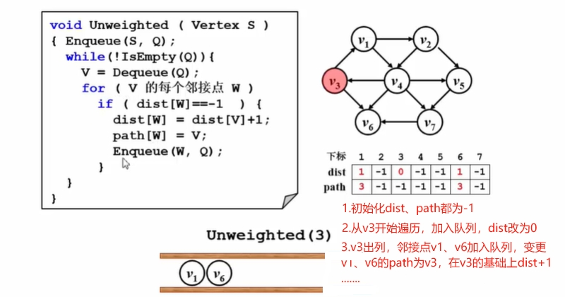

> `有权图`（有向/无向）：按照`递增（非递减）`避免负线圈 的顺序找出各个顶点的最短路径；`Dijkstra算法`用于解决这一问题。

>  :::info Dijkstra算法
> - 令S = { 源点s \+ 已经确定了最短路径的顶点Vi }
> - 对于任一未收录的顶点v，定义dist[v]为 s 到 v 的最短路径长度，但该路径仅经过S中的顶点， 即路径 {s →（ vi ∈ S） → v }的最小长度（ vi ∈ S）是S中的最小路径
> - 路径按照`递增（非递减）`的顺序生成
>> 1. 则正真最短路径必须只经过S中的顶点；
>> 2. 每次从未收录的顶点中选一个dist最小的收录（采用`贪心算法`策略）；
>> 3. 增加一个v进入S，可能影响另外一个 w 的dist值；dist[w] = min { dist[w] ， dist[v] + \< v ， w \>的权重}

> **Dijkstra算法收录方式**： 
> 方法一： 直接扫描所有未收录的顶点 O（|V|），---- 稠密图优势
>> T=O（|v|2 \+ |E|）

> 方法二： 将dist存在最小堆中 O（log|V|）， ---- 稀疏图优势
>> 更新dist[w]的值 O（log|V|）

>> T=O（|v|log|V| + |E|log|V|）= O（|E|log|V|）

> **Dijkstra算法实现**：
> 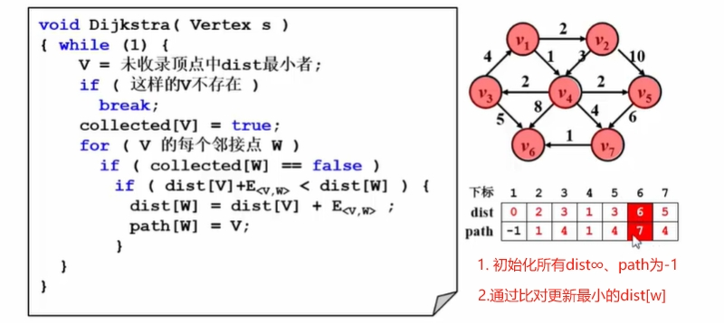

 

多源最短路径：

方法一：直接将单元最短路径算法调用|V|遍
> T=O（|v|3 \+ |E|*|V|），对于稀疏图比较合算；

方法二：Floyd算法
> T=O（|v|3），对于稠密图合算；

:::info Floyd算法
Floyd 算法是一种`动态规划算法`，基于矩阵运算实现。其思想是通过中间节点逐步优化两个节点之间的距离。首先初始化一个邻接矩阵，其中每一个元素表示两个节点之间的距离，若节点之问没有边，则距离为无穷大。

- 不是很理解，待补充...

:::

## 最小生成树

**是一颗树**：
> - 无回路；
> - |V|个顶点一定有|V|-1条边；

**是生成树**：
> - 包含全部顶点；
> - |V|-1条边都在图里；
> - 向生成树中任加一条边，都一定构成回路；
> 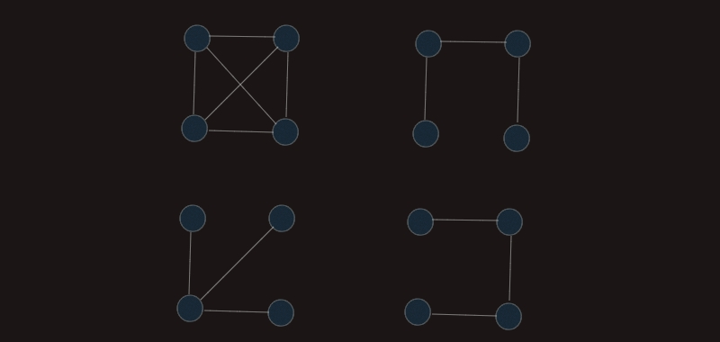

**边的权重和最小**

:::danger 贪心算法
- 什么是“贪”：每一步都要最好；
- 什么是“好”：权重最小的边；
- 需要约束：
  > 只能用图里有的边

  > 只能正好用掉|V|-1条边

  > 不能有回路
:::

 

## Prim算法（生成最小生成树）

> 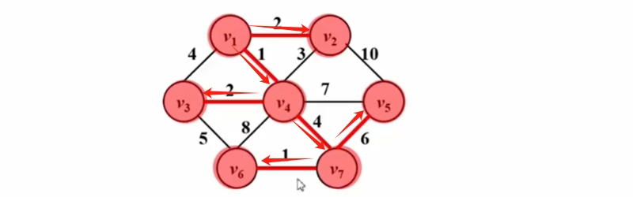

> 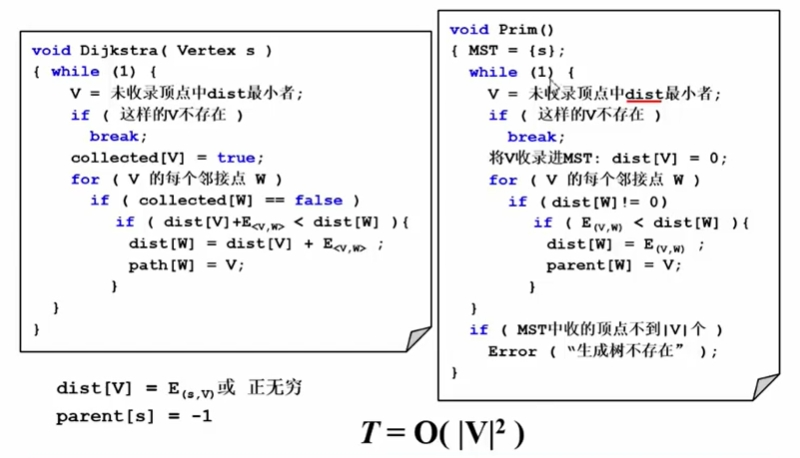

## Kruskal算法 （将森林合并成树）

> 

> 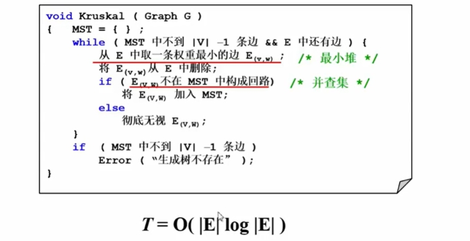

## 拓扑排序

- **拓扑序**：如果图中从V到W有一条有向路径，则V一定排在W之前。满足次条件的顶点序列称为一个`拓扑序`；

- 获得一个`拓扑序`的过程就是`拓扑排序`；

- AOV如果有合理的拓扑序，则必定是`有向无环图`（Directed Acyclic Graph,DAG）；

> 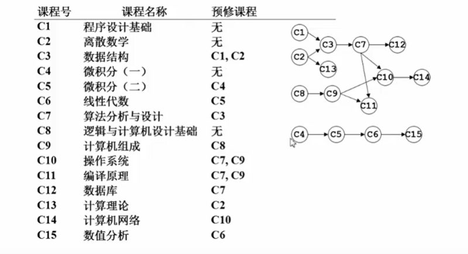

> 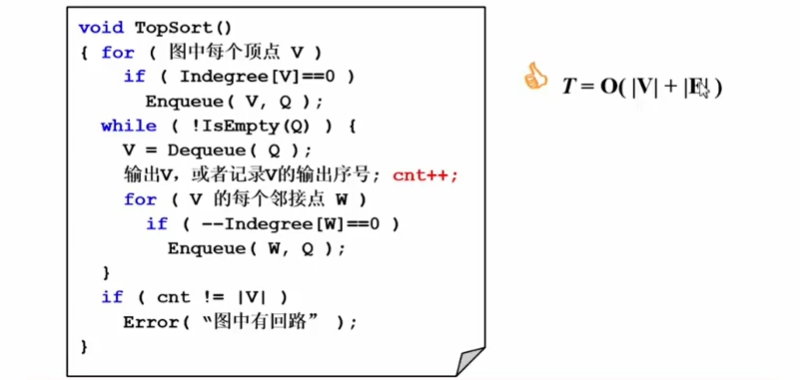

## 关键路径

> 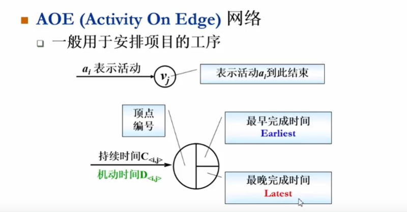

> 