# 什么是线性表

线性表（Linear Lsit）：由`同类型数据元素`构成`有序序列`的线性结构；

:point_right: 表中元素个数称为线性表的`长度`；

:point_right: 线性表没有元素时，称为`空表`；

:point_right: 表的起始位置称为`表头`，表的结束位置称为`表尾`；

## 线性表的抽象数据类型描述

:::info 抽象数据类型描述
类型名称：线性表(List)；

数据对象集：线性表是n(n>=0)个元素构成的有序序列（a1,a2,a3....an）；

操作集：线性表L∈List，整数i表示位置，元素X∈ElementType；

> 1、初始化一个空线性表L；
> 
> 2、根据位序K，返回相应元素；
> 
> 3、在线性中查找X的第一次出现位置；
> 
> 4、在位序i前插入一个新元素X；
> 
> 5、删除指定为序i的元素；
> 
> 6、返回线性表L的长度n；
:::

## 线性表的实现

:::details 【数组实现线性表】
1. 初始化（建立空的顺序表）
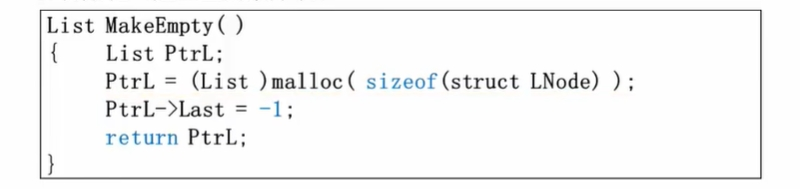
2. 查找 ---- O(n)
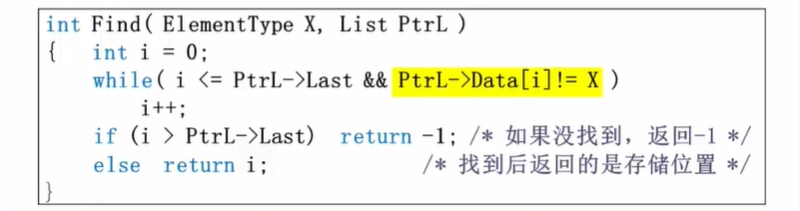
3. 插入
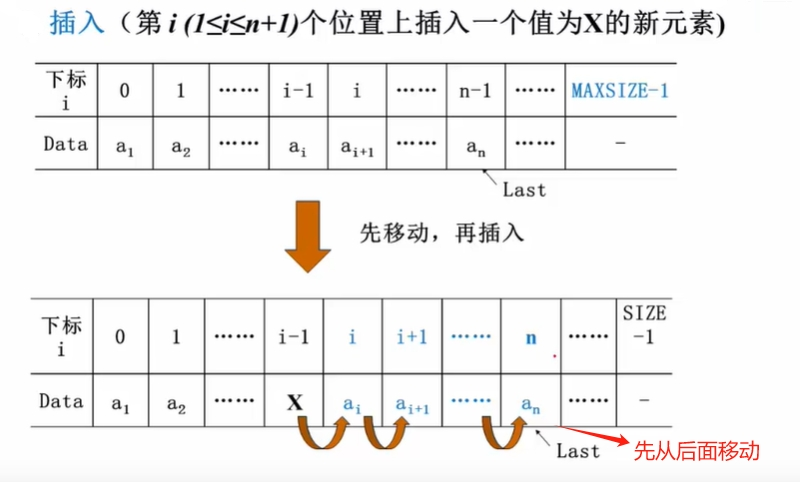
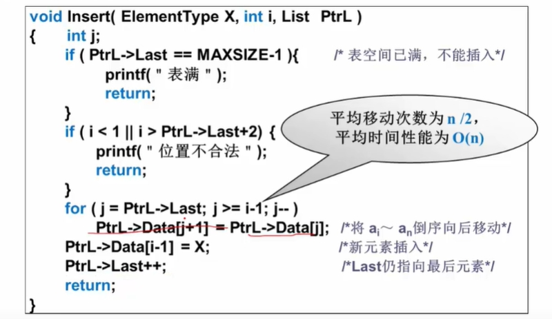
4. 删除
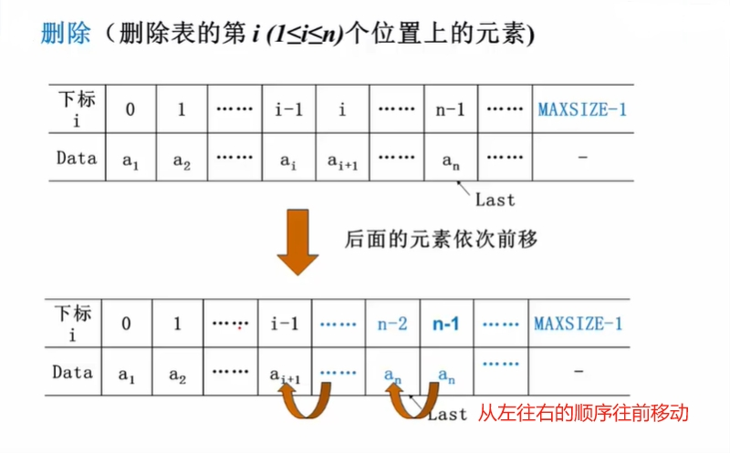
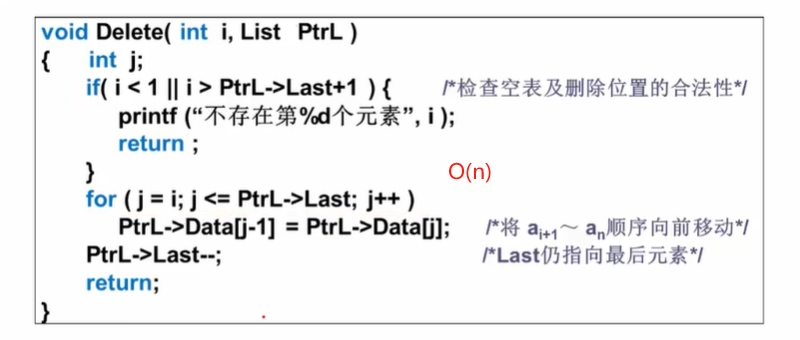
:::

:::details 【链表实现线性表】
1. 长度
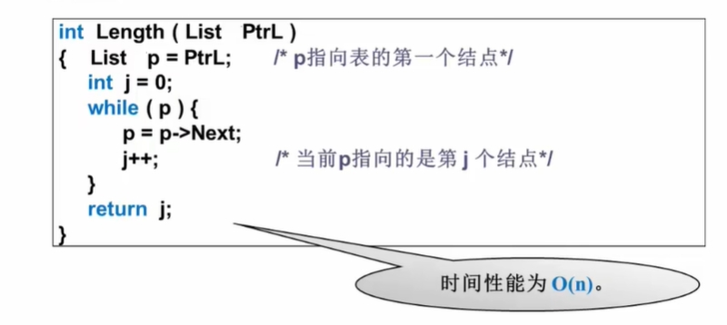
2. 查找
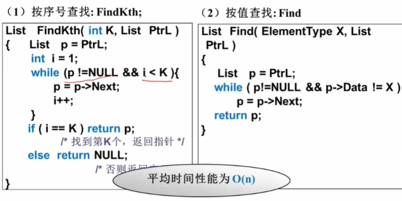
3. 插入
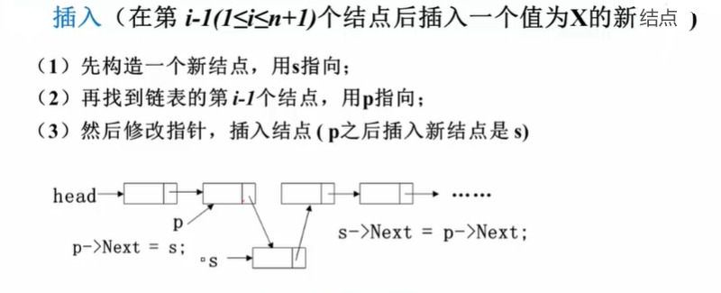
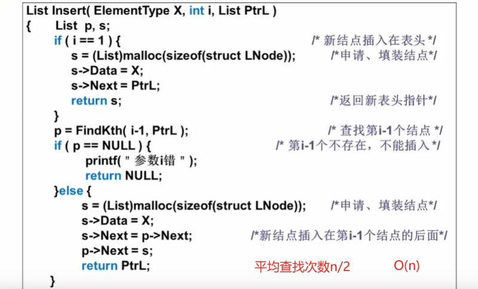
4. 删除
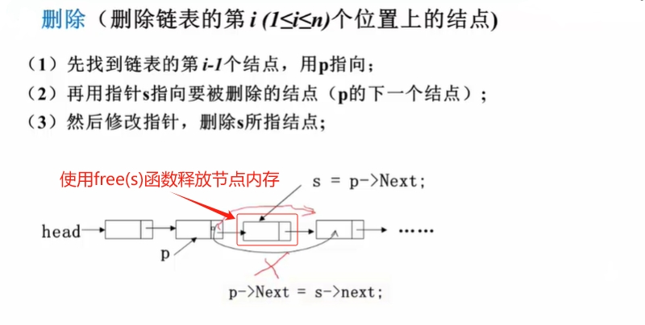
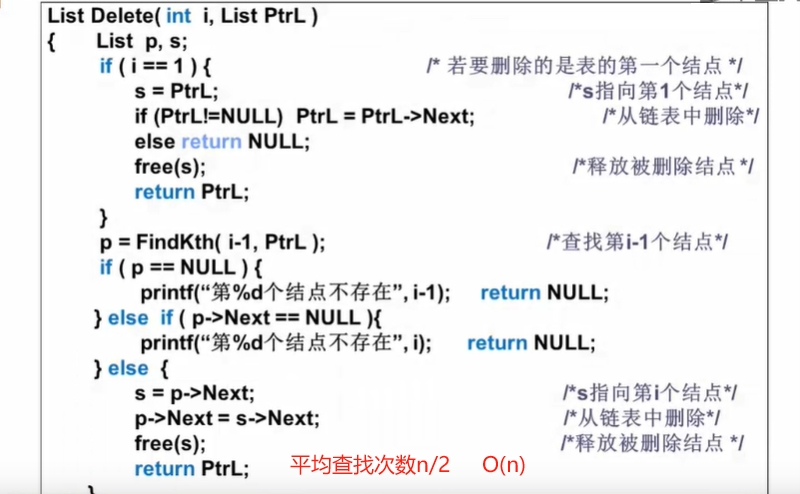
:::

## 广义表

:::tip 什么是广义表
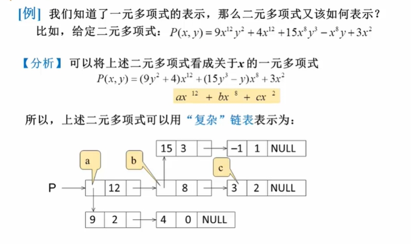
二元多项式，表示为一元多项式。---> 广义表
:::

:point_right: 广义表是`线性表的推广`；

:point_right: `对于线性表而言，n个元素都是基本的单元`，而`广义表中`，这些元素也可以是`另一个广义表`；
> c++语言中通过联合类型union解决共存问题，union可以把不同类型的数据组合在一起；

## 多重链表

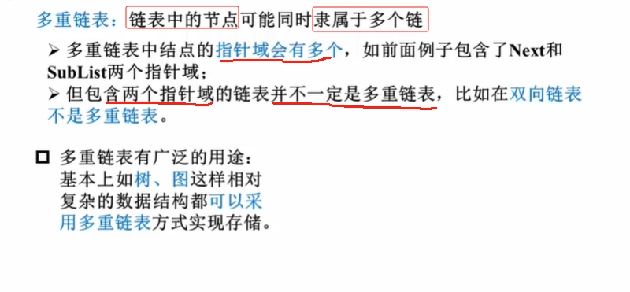
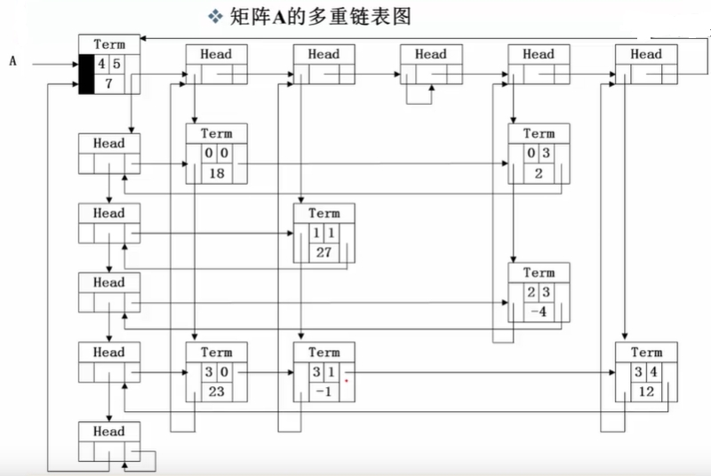
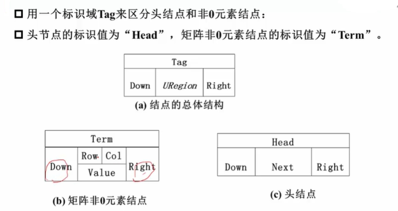