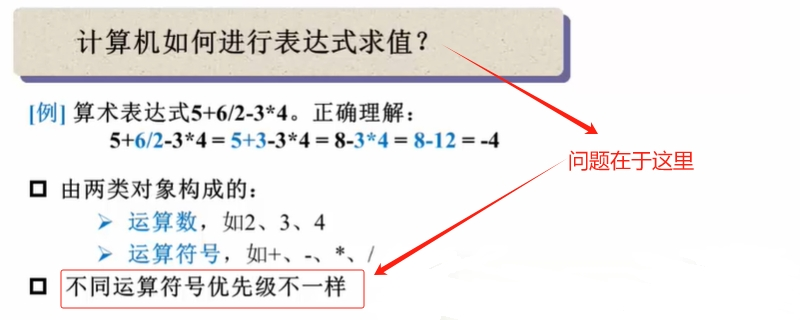
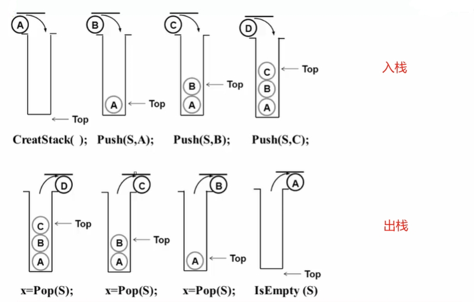
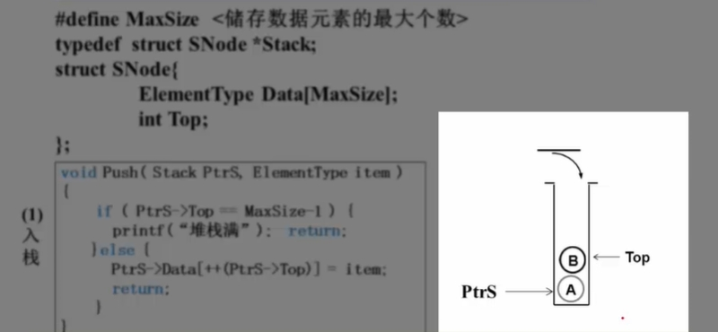
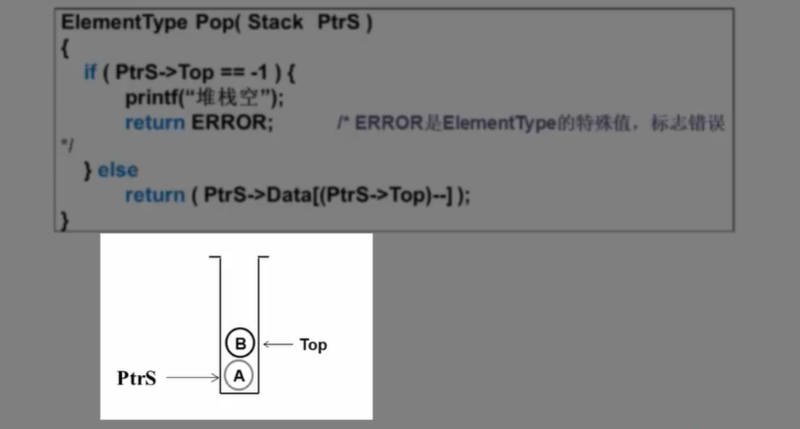
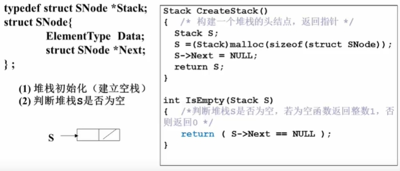
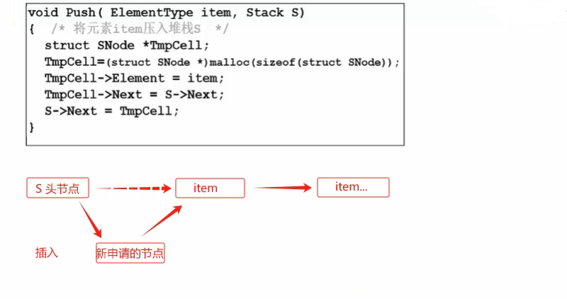
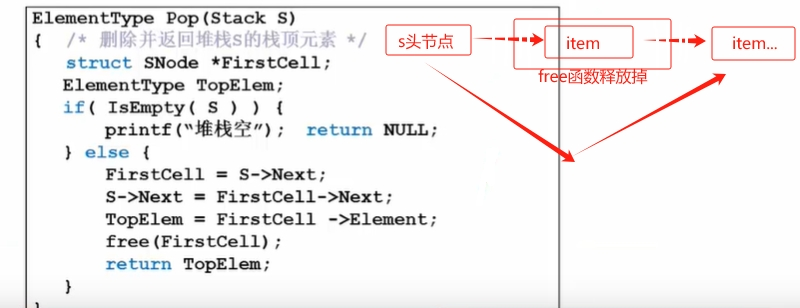

# 什么是栈

栈也是一种特殊的线性表，在计算机学科里面有广泛的用途，如`函数调用`、`递归`、`表达式求值`等都要用到栈。

:::info 【表达式求值】示例

**问题**： 因为运算符是有优先级的，所以上图中我们所看到的 **6** 他可能就不是用来做加法运算的，这个问题就变得复杂了。

**解决**： 如果我们看到运算符号，就知道两个运算数了，这个问题就很好解决了。刚好`后缀表达式`能满足。
:::tip 提示
**前缀表达式**：运算符号位于两个运算数之前

**中缀表达式**：运算符号位于两个运算数之间（a + b * c - d / e）  <Badge type="tip" text="平常使用" />

**后缀表达式**：运算符号位于两个运算数之后（a b c *+ d e /-）
> 后缀表达式的求值策略：从左向右“扫描”逐个处理运算数和运算符号。碰到数先依次记下，碰到`运算符`就计算`运算符`前记下的两位`数`。

> 示例：6 2 / 3 - 4 2 * + = ？ 

【**启示**】
> 我们需要一种存储方法，满足我们能顺序存储运算数，并在需要时“倒序”输出（也就是`后进先出`，这就是**栈**）。
:::

## 栈的抽象数据类型描述

:::info 抽象数据类型描述
类型名称：栈（Stack）；

数据对象集：一个有0个或多个元素的有穷线性表；

操作集：长度为MaxSize的栈S ∈ Stack，栈元素item ∈ ElementType
>
> 1. 生成空栈，其最大长度为MaxSize；
>
> 2. 判断栈S是否已满；
>
> 3. 将元素item压入栈底；
>
> 4. 判断栈S是否为空；
>
> 5. 删除并返回栈顶元素；
:::

:::tip 栈（Stack）
栈是具有一定操作约束的线性表（**先进后出**）

:point_right: 只在一端（栈顶、Top）做插入入栈（Push）、删除出栈（Pop）。

:::

## 栈的实现

:::details 【数组实现栈】
1. 入栈

2. 出栈

:::

:::details 【链表实现栈】
栈的链式存储结构实际上就是一个`单链表`，叫做`链栈`。插入和删除操作只能在`链栈`的栈顶进行。栈顶指针应该在链表头部，因为是单链表，如果放在尾部删除操作会有问题。
1. 初始化

2. 入栈

1. 出栈

:::

## 栈的应用

- 中缀表达式转换为后缀表达式

- 函数调用及递归实现

- 深度优先搜索
  
- 回溯算法

- ......