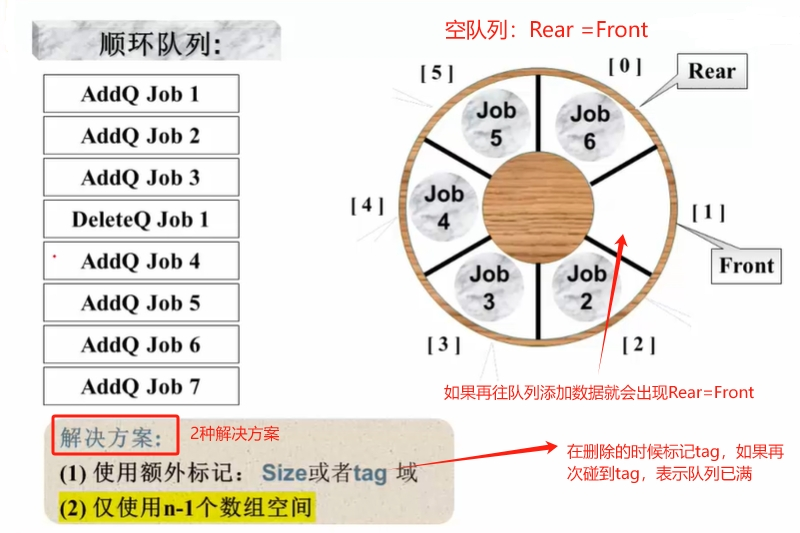
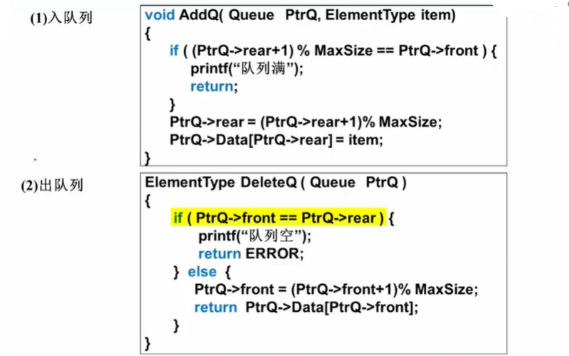

# 什么是队列
队列（Queue）是具有一定操作约束的线性表（**先进先出**）

:point_right: 插入和删除操作：只能在一端`插入`，而在另一端`删除`。

## 队列的抽象数据类型描述

:::info 抽象数据类型描述
类型名称：队列（Queue）；

数据对象集：一个有0个或多个元素的有穷线性表；

操作集：长度为MaxSize的队列Q ∈ Queue，队列元素item ∈ ElementType
>
> 1. 生成长度为MaxSize的空队列；
>
> 2. 判断队列Q是否已满；
>
> 3. 将元素item插入队列Q中；
>
> 4. 判断队列Q是否为空；
>
> 5. 将队列的头数据元素从队列中删除并返回；
:::

## 队列的实现（循环队列）

队列的顺序存储结构通常由一个一维数组和一个记录队列`头元素位置的变量front`以及一个记录队列`尾元素位置的变量rear`组成。

:::details 【数组实现队列】

:::

:::details 【链表实现队列】
...
:::

