# 什么是树

## 示例
:::info 数据管理的基础操作查找【示例】
**查找**：根据某个给定的`关键字K`，从`集合R`中找出与关键字K相同的值。
- `静态查找`：集合记录是固定的，没有插入和删除操作，只有查找。（如：查字典）
- `动态查找`：集合记录是动态变化的，除了查找，还可能发生删除和插入操作。（如：借图书）

:::tip **静态查找**
**静态查找-顺序查找**：静态查找，最直接、最简单的方式就是`顺序查找`。

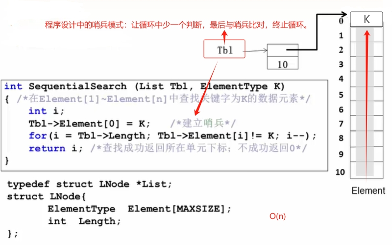

 
如果数据比较大，`顺序查找`往往不是效率最好的方法。 `二分查找` 的效率要遥遥领先。
 
 

**静态查找-二分查找**：二分查找必须满足，1. 有序，2. 连续存储（数组）
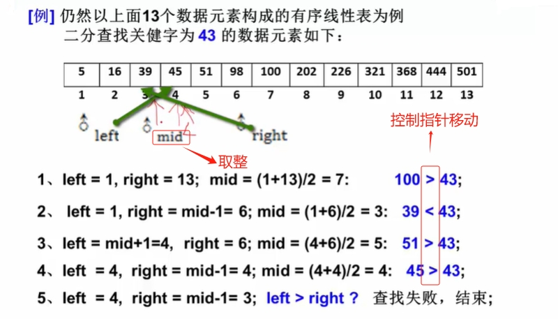
代码实现
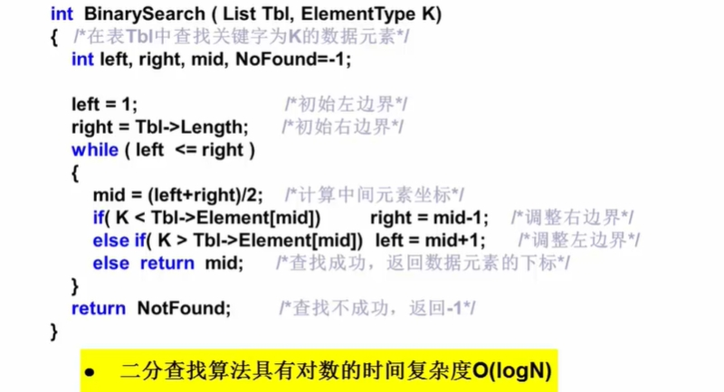
:::

## 分析

## 启示
客观的世界中许多事物存在层次关系：

:point_right:人类社会家谱；

:point_right:社会组织结构；

:point_right:图书信息管理；

这些其实都是`树`结构。分层次组织在管理上具有更高的效率。

**那么我们能不能把数据不存放在数组里面呢？我们就按照层次化结构来存数据，是不是也能达到我们想要的效果呢？按照层次化结构来存数据，这就是我们`查找树`的概念**。

- 查找树和二分查找在效率上可以达到相同效果。
- 查找树还可以解决我们另一个问题，`动态查`找的问题。

## 树

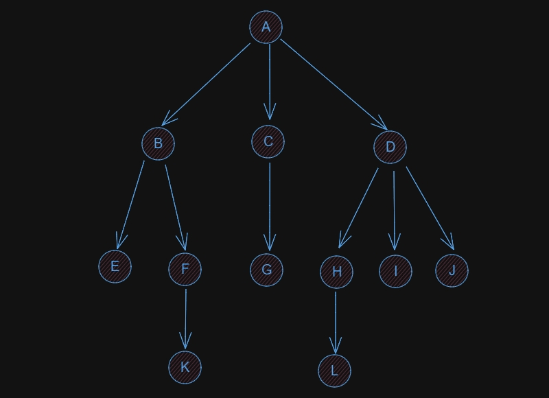

## 树的定义

**树（Tree）：n (n >= 0)个节点构成的有限集合。**

**当n = 0时，称为空树。**

**当n > 0时，对于一颗非空树，它具备一下性质：**

1. 树中有一个特殊结点称为“`根（Root）`”，用 `r`表示。

2. 其余结点可分为m（m 0 ）个`互不相交`的有限集T1,T2...Tm，其中每个集合本身又是一颗树，称为原来树的“`子树（SubTree）`”

3. 子树不相交。

4. 每个结点仅且仅有一个父结点（除根结点外）。

5. 一颗N个结点的树有`N-1条边`（根结点没有）。

## 树的术语

1. `结点的度（Degree）`：结点的子树个数。
2. `树的度`：树的所有结点中最大的度数。
3. `路径`：从A到K的路径为一个结点序列A，B，F，K（从上往下）。
4. `路径长度`：路径所包含`边`的个数，为路径长度。
5. `叶节点（Leaf`）：度为0的结点。
6. `父结点`：直接的上下关系结点。
7. `子结点`：直接的上下关系结点。
8. `兄弟结点`：拥有同一个父结点。
9. `祖先结点`：沿着根结点到某一个结点的路径上的所有结点，都是这个结点的祖先结点。
10. `子孙结点`：某一个结点的子树所有结点，都是这个结点子孙结点。
11. `结点的层次（Level）`：规定根结点在第1层，其他结点是父结点+1。
12. `树的深度（Depth）`：树中所有结点中的最大层次是这颗树的深度。

## 树的表示

**【数组】表示**：如果使用数组实现，有些情况会非常麻烦，且对程序设计也不友好。

**【链表】表示**：如果用链表实现，当结点结构不一致，对后续的程序设计造成负担。

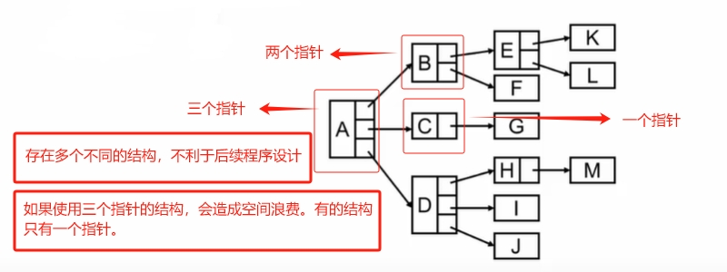

如果使用3n个指针域，我们实际上只有n-1个边。也就是说会有，3n - (n -1)个空指针域，会造成空间浪费。

**【儿子-兄弟】表示**：在链表的表示基础上做了优化，将每个结点设置成为统一的结构（包含两个指针的结构）。
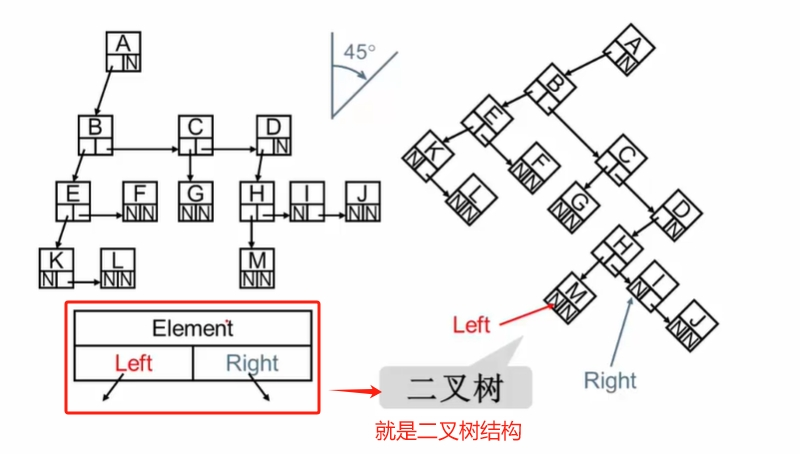
`二叉树`结构，减少了空间的浪费，同时保证每个结点结构的统一，度为2。

## 二叉树（T）
**二叉树的定义**：
> 一个有穷的结点集合。这个集合可以为空，若不为空，则它由`根结点`和称为其`左子树`TL和`右子树`TR的两个不相交的二叉树组成。

**二叉树基本形态**：
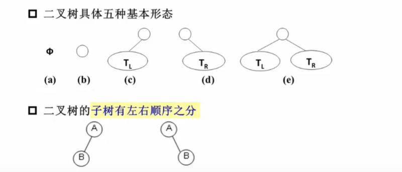

**特殊二叉树**：
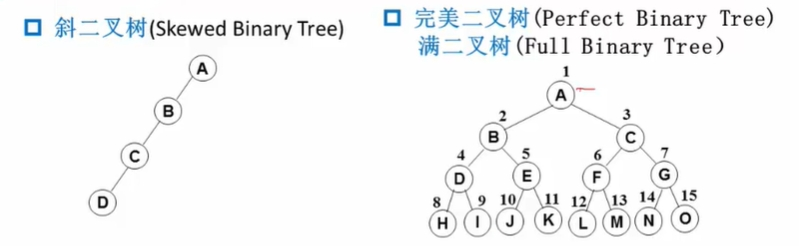
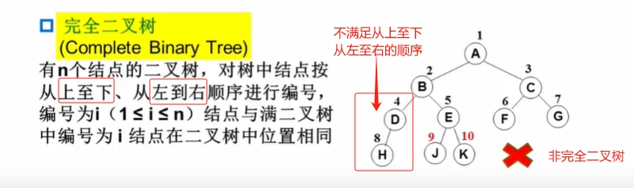

**二叉树的几个重要性质**：

:red_square: 一个二叉树第 i 层的最大结点数据为：**2i-1，i >= 1**。
> 完美二叉树

:red_square: 深度为 K 的二叉树的最大结点总数为：**2k-1，k >= 1**。
> 1 + 21 + 22 + ... + 2k-1 = 2k - 1

:red_square: 任何非空二叉树T
> 若n0表示叶节点，n1表示度为1的结点数，n2表示度为2的结点数。
>
>   **一定存在 n0 = n2 + 1** 

## 二叉树的抽象数据类型描述
:::info 抽象数据类型描述
类型名称：二叉树

数据对象集：一个有穷的结点集合，若不为空，则由根结点和其左、右二叉子树组成。

操作集：BT ∈ BinTree，Item ∈ ElementType，重要操作有：
> 1. 判别BT是否为空。
>
> 2. 遍历，按某种顺序访问每一个结点。
>
> 3. 创建一个二叉树。
:::

## 二叉树的遍历
二叉树的遍历非常重要，很多算法设计都是建立在二叉树遍历的基础上的。

:::details `先序`遍历：根、左子树、右子树；
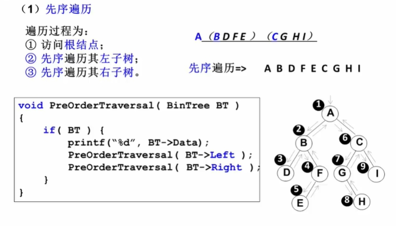
:::

:::details `中序`遍历：左子树、根、右子树；
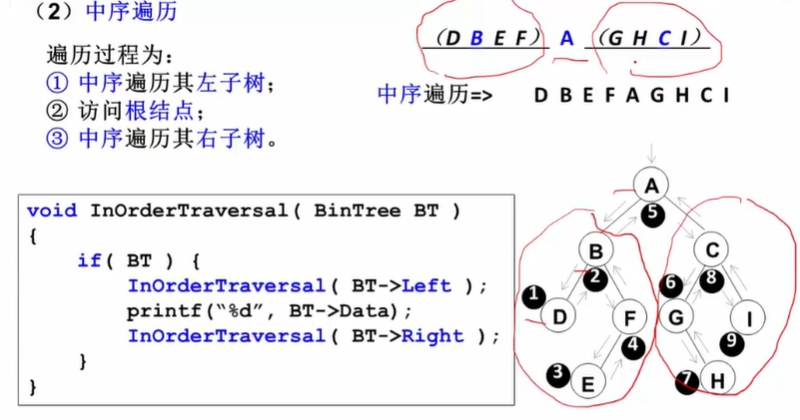
:::

:::details `后序`遍历：左子树、右子树、根；

:::

:::details 注意
:red_circle: 先序、中序、后序都是基于递归的方法。
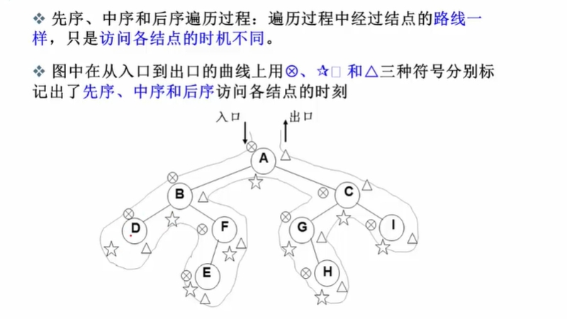
 
:red_circle: 二叉树的`非递归`遍历，`使用堆栈`。

**非递归中序遍历算法【示例】**

> 1. 遇到一个结点，就压入栈中，并去遍历它的左子树。
>
> 2. 当左子树遍历结束，从它的栈顶弹除这个结点并访问它。
> 
> 3. 然后按其右指针再去中序遍历该结点的右子树。
> 
> 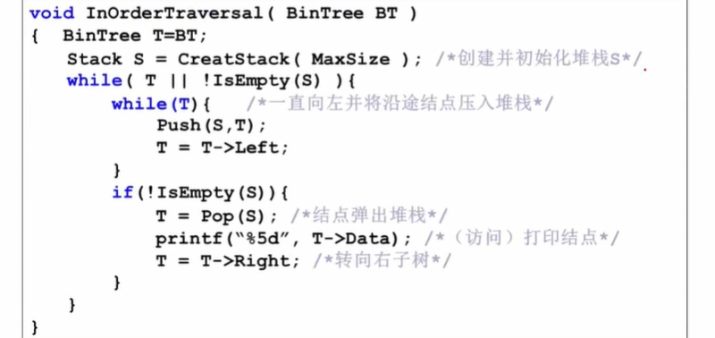

非递归先序、后序遍历算法和非递归中序遍历算法大致一样，应为他们遍历路径是一样的。
:::

:::details `层次`遍历：从上到下、从左到右；
**二叉树遍历的核心问题：`将二叉树二维结构的线性化`**
>**问题**：从结点访问其左、右儿子结点，当访问左儿子结点，右儿子结点（可能有多层）怎么办？
>
>**解决**：可以使用`堆栈`、`队列`的储存结构存储暂时不访问的结点。
>
>**实现**：从根结点开始遍历，首先将根结点加入队列。然后执行循环：结点出队，访问该结点，其左右儿子结点加入队列。
> 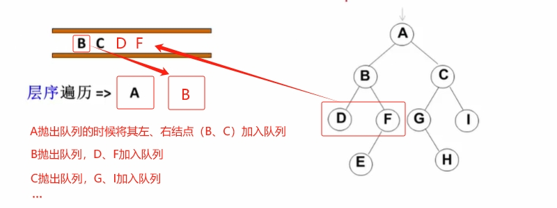
> 代码实现步骤
> 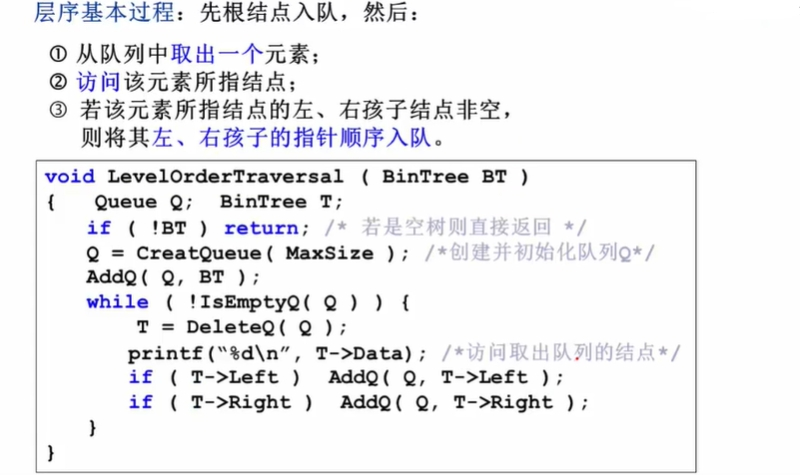
:::

## 二叉树的存储

:::details 【数组实现二叉树存储】
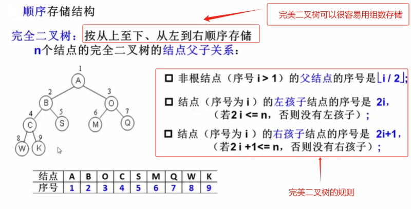

:::

:::details 【链表实现二叉树存储】
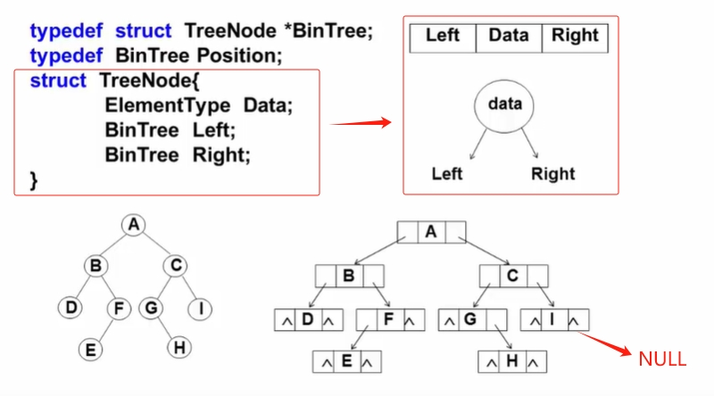
:::

## 二叉树【题】

1. 给定一个二叉树，输出二叉树的中叶子结点。
2. 给定一个二叉树，求二叉树的深度。
3. 由两种遍历序列确定二叉树。
4. 判断同构树。

....

## 二叉搜索树

**二叉搜索树，也称`二叉排序树`或`二叉查找树`。可以为空，当不空有以下性质：**

:red_circle: 非空`左子树`的所有`键值`小于其`根结点`的`键值`。

:red_circle: 非空`右子树`的所有`键值`大于其`根结点`的`键值`。

:red_circle: 左、右子树都是二叉搜索树。

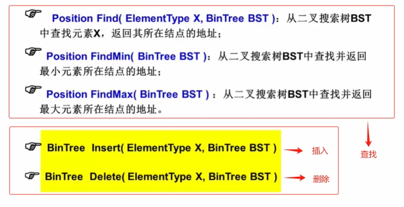

:::details 二叉搜索树【查找、插入、删除】
**查找**
> 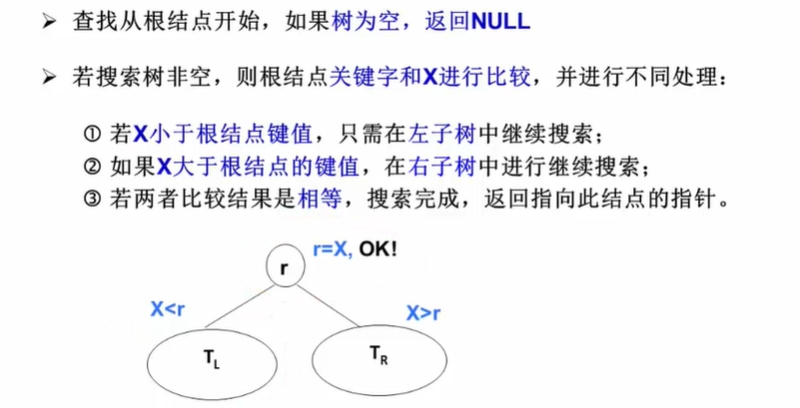
> 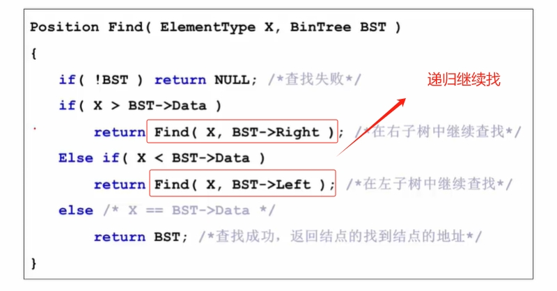
> **递归实现的效率不高，`尾递归`一般都可以使用循环的方式实现。**
> 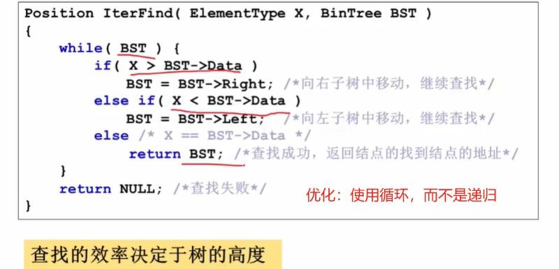

> **最大值最小值查找**
> 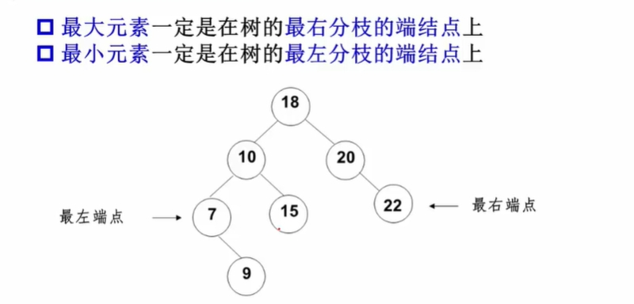
> 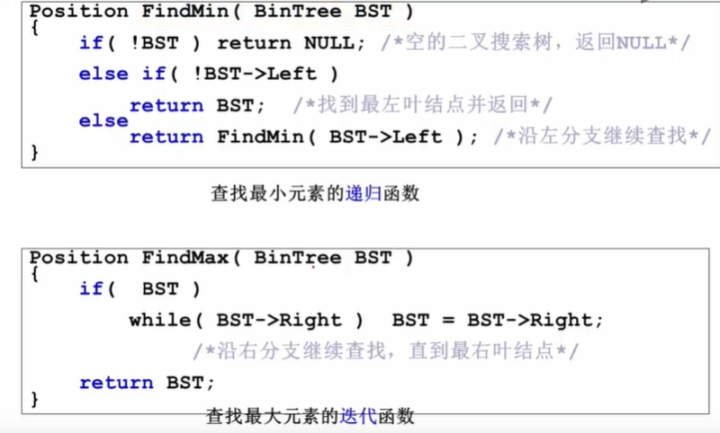

**插入**
> 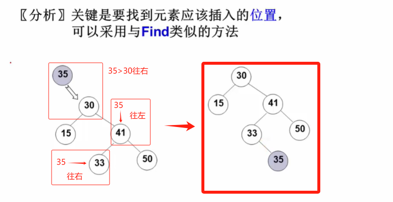
> 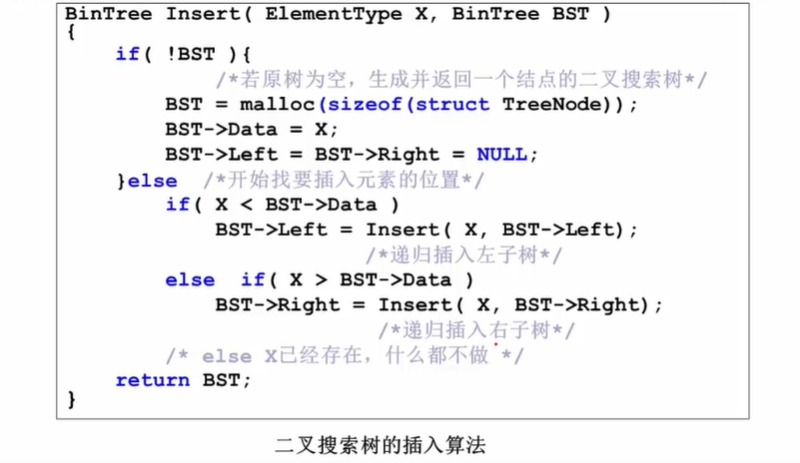
**删除**

> 叶节点（只有一个儿子结点）：找到后直接删除。
>
> 复杂情况：有枝叶结点（多个结点）。
> 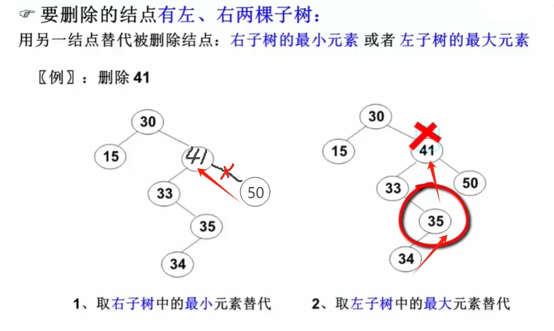
> 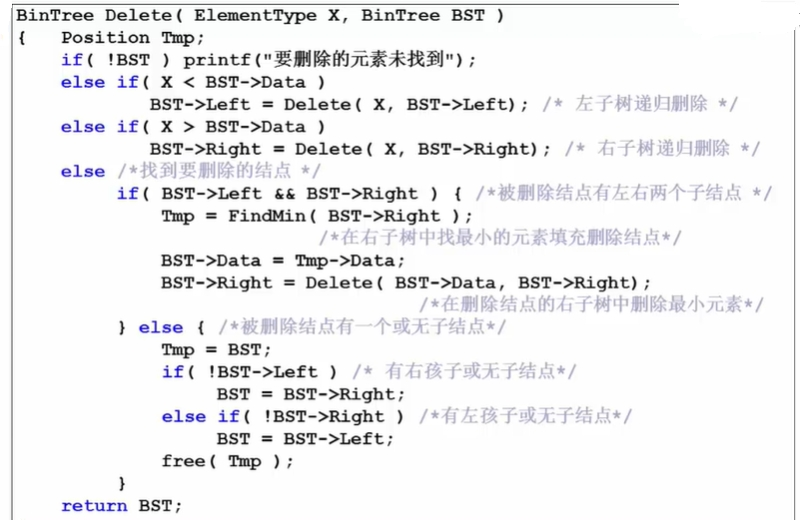
:::

## 平衡二叉树

:::info 什么是平衡二叉树？
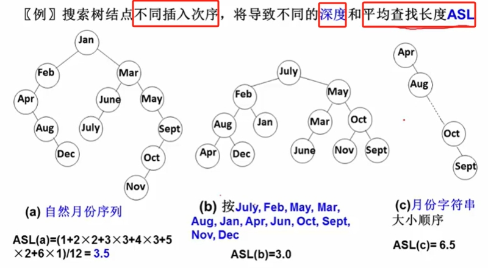

不同的插入次序，会生成不同的二叉树结构，有的查找快，有的查找慢。我们要怎么样设计，才能最优呢？→ `平衡二叉树`
:::

**平衡二叉树**（Balanced Binary Tree）也叫AVL树，在AVL树中，任一节点对应的两棵子树的最大高度差为1，因此它也被称为高度平衡树。查找、插入和删除在平均和最坏情况下的时间复杂度都是O(logn)。
- 为空时，叫空树。
-  不为空时，任一结点左、右子树`高度差`的绝对值不超过1，`|BF(T)| <= 1`。 
> BF(T) = hL - hR: `平衡因子(Balance Factor，简称BF)`，其中hL、hR分别为T的`左、右子树的高度`。

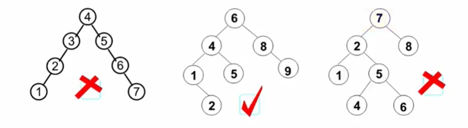

平衡二叉树的高度能达到 log2n 吗？我们所希望的树能够平衡一点，树越平衡高度越低。
::: info 拓展
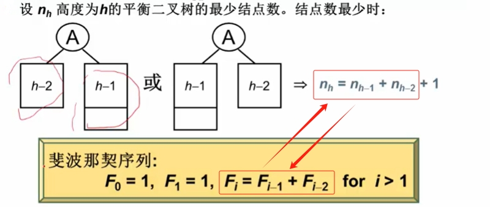
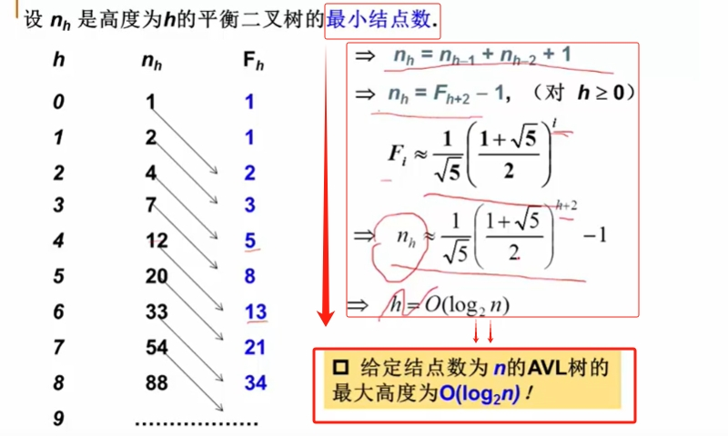
:::

## 平衡二叉树调整

**平衡二叉树调整有四个基本操作**

所有的平衡操作都依据`被破坏结点`（|BF(T)| <= 1 这个不成立时）

:::details RR旋转（左左旋转）
`破坏者`插入在`被破坏者`的`右子树的右子树`上。

:::

:::details LL旋转（右右旋转）
`破坏者`插入在`被破坏者`的`左子树的左子树`上。
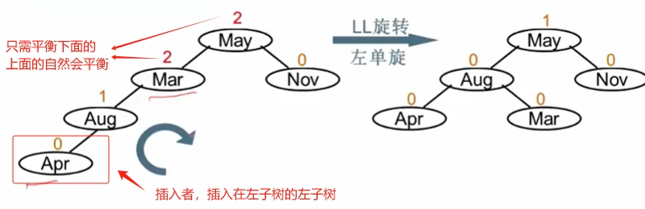
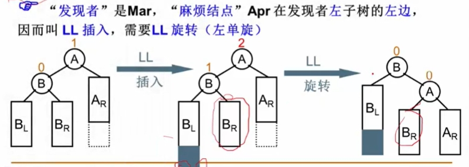
:::

:::details LR旋转（左右旋转）
`破坏者`插入在`被破坏者`的`左子树的右子树`上。
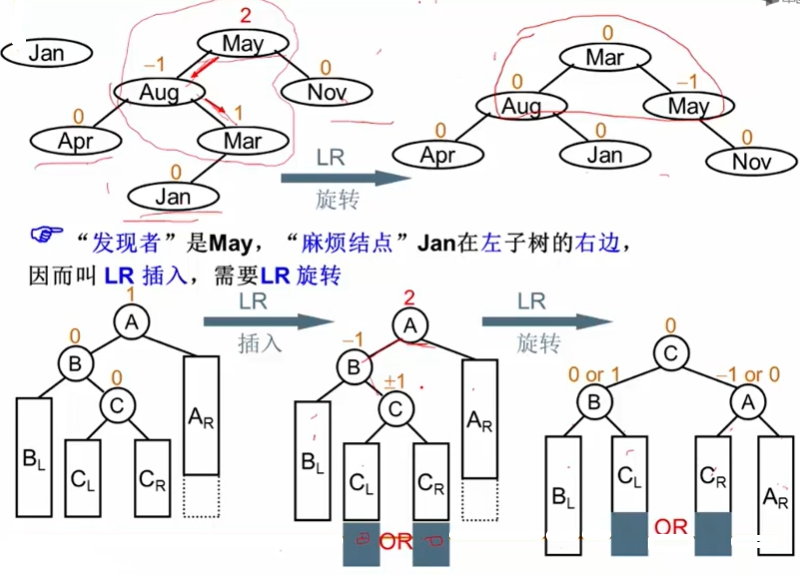
:::

:::details RL旋转（右左旋转）
`破坏者`插入在`被破坏者`的`右子树的左子树`上。
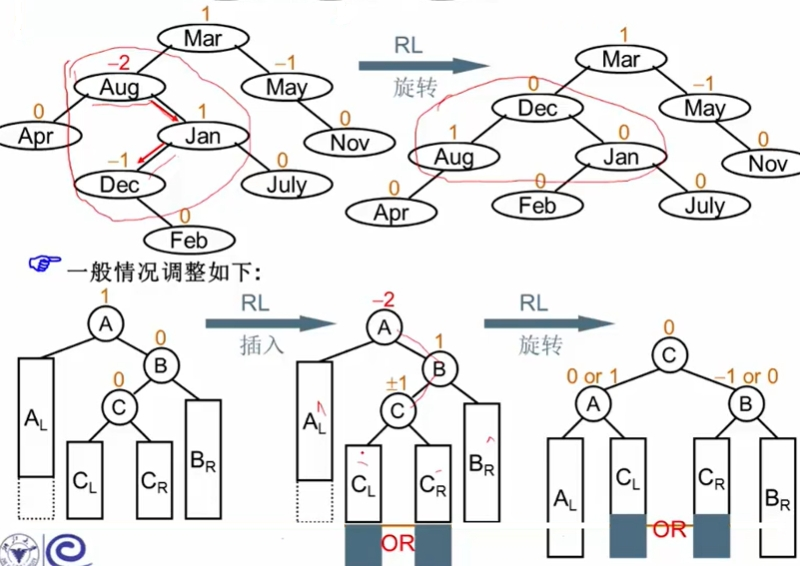
:::

