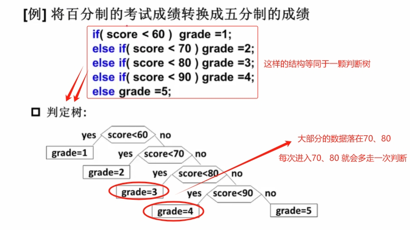
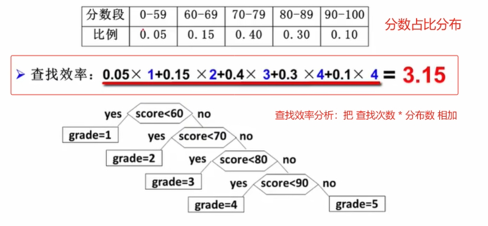
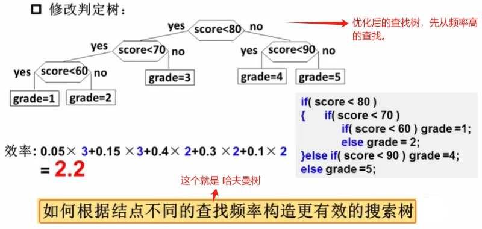
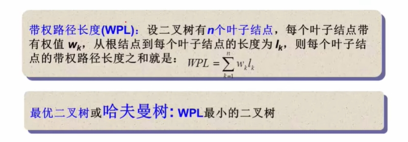
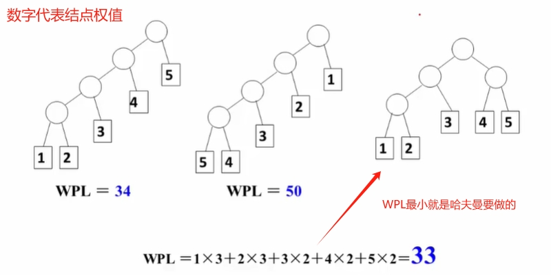

# 什么是哈夫曼树

## 示例

:::info 考试成级查找【示例】

这样的效率并不是最优的，有没有更好的方法？下面我们对判断树进行优化。

示例中的`效率`也就是，`带权路径长度`。
:::

## 定义

给定N个权值作为N个叶子结点，构造一棵二叉树，若该树的带权路径长度达到最小，称这样的二叉树为`最优二叉树`，也称为`哈夫曼树(Huffman Tree)`。

**哈夫曼树是带权路径长度最短的树，权值较大的结点离根较近**。

WPL

## 哈夫曼树构造
每次把`权值最小的两棵二叉树`合并。