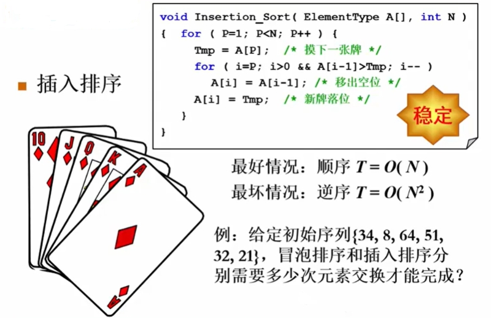

# 插入排序

- 就是跟打扑克一样的，摸到一张牌就插入一张牌（插入时的顺序看与小的比还是与大的比）；

都有需要`交换9次`,这是巧合吗？

 

## 时间复杂度下届

**逆序对：对于下标i < j，如果A[i] > A[j]，则称(i,j)是一对逆序对(inversion)**

:::tip 问题-序列{34,8,64,51,32,21}中有多少逆序对?
(34,8)(34,32)(34,21)(64,51)(64,32)(64,21)(51,32)(51,21)(32,21) `9个逆序对`；
- 交换2个相邻元素每次正好消去1个逆序对；
- 插入排序:T(N,I)=O(N+I)；
- 如果序列基本有序，则`插入排序简单且高效`；
:::

- 定理1：任意N个不同元素组成的序列平均具有N(N-1)/4个逆序对；
- 定理2：任何仅以交换相邻两元素来排序的算法，其平均时间复杂度为Ω(N2)；
- 这意味着：要提高算法效率，我们必须
  > 每次消去不止1个逆序对；
  >
  > 每次交换相隔较远的2个元素；